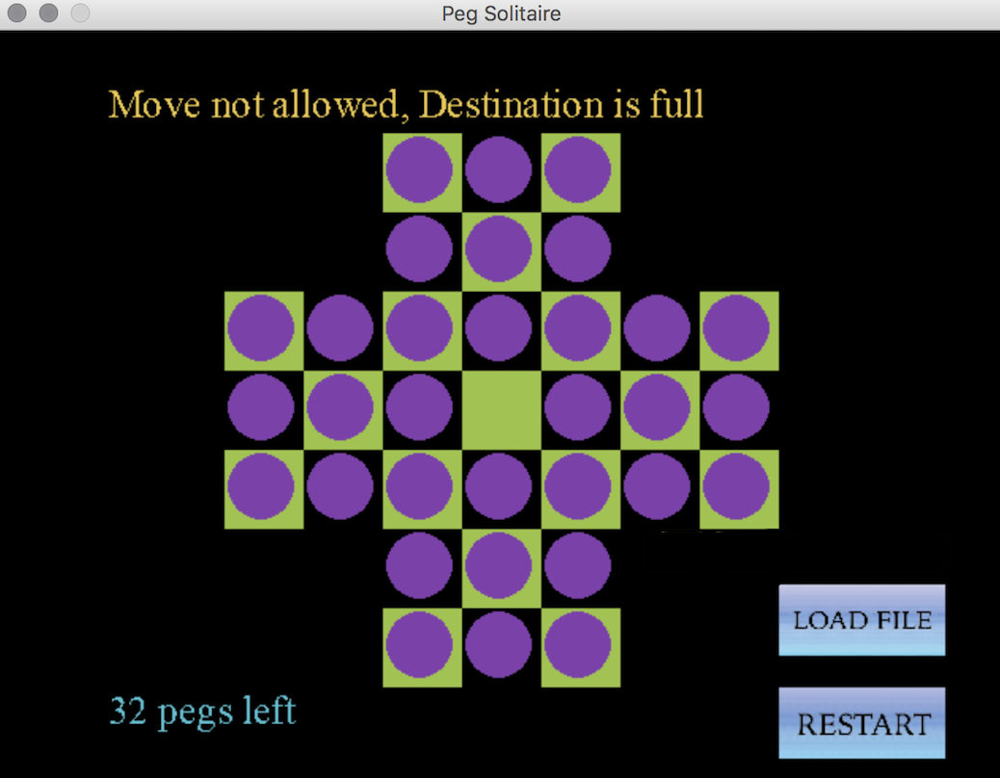

# User Guide for Peg Solitaire

## To Run The Game

This program uses the following:
- python version 3.6.2
- pygame version 2.1.2

If you do not have python installed, type the following commands in the terminal (can be accessed by searching _terminal_ on your computer):
#### MAC:
```
brew install pyenv
pyenv install 3.6.2
```
_If you do not have homebrew google how to install it_

#### Ubuntu:
```
sudo apt-get update
sudo apt-get install python3.6
```

#### Windows:

&nbsp;&nbsp;&nbsp;&nbsp;&nbsp;&nbsp; Download the installer from the official python website. Click on the exe file and install normally.

\
If you do not have pygame installed, use the following command:
#### MAC:
```
pip install pygame 2.1.2
```
_If you face any issues with this, check to see if there is any dependency you don't have installed. The website stackoverflow.com may be helpful for guidance._

#### Ubuntu
```
sudo apt-get install python-pygame
```
#### Windows
```
pip install pygame
```
\
To run the program, open a terminal and type the following:
```
cd <address of the project directory (should end in pegSolitaire)>
python main.py
```

## To Play the Game
When you run the game, an interface like the picture below should pop up.

<div>

</div>

You can select a peg to move by clicking on it. The chosen peg will turn orange and you can then click on the destination of your peg. If the move is legal, the peg will be moved to your chosen destination and if not, it will stay where it is and you will have to choose which peg to move again.\
The legal moves are the same as the standard peg solitaire game; Two spots to the left, right, up or down, with an empty destination and a peg between the location of the chosen peg and location of the peg's destination.
To unselect a peg, click on it again.\
If you Make an illegal move you will get an error message at the top of your screen.

<table><tr>
<td>  </td>
<td>  </td>
</tr></table>


The wining condition is having only one peg left on the board, with the location of this peg being in the middle of the board at spot (3,3). The number of pegs on the board is shown on the bottom left side of the game screen.


<div>

</div>


If you start typing, what you write will be considered as the address and name of the game file you wish to load. If you move a peg the writing space disappears, but if you press the SPACE button or start typing again the file address and name will reappear. If you do not type a file location and name before pressing the load button a predefined partial solution file will be loaded. A file named solution1.txt is also available and if you type its name and press the load file button it will play out a complete solution for you. You do not need to specify a location if your file is in the same directory as main.py.

<table><tr>
<td>  </td>
<td>  </td>
</tr></table>

Your file location and name cannot have any spaces between them. You cannot press the load button if you have a selected peg (you must either move or unselect it first). The game cannot be quit while the game file is loading.
Your file must contain a list of complete moves.\
The content of your solution file must be in the <X, Y> board coordinate format like the example below:

1,3 3,3

This will move the peg in the 1,3 spot to the 3,3 spot. The coordinate numbers are based on the board below:

&nbsp;&nbsp; 0&nbsp; 1&nbsp; 2&nbsp; 3&nbsp;&nbsp; 4&nbsp; 5&nbsp; 6 → **X** \
0&nbsp;&nbsp;&nbsp;&nbsp;&nbsp;&nbsp;&nbsp;&nbsp;&nbsp;●&nbsp;&nbsp;●&nbsp;&nbsp;●       	
1&nbsp;&nbsp;&nbsp;&nbsp;&nbsp;&nbsp;&nbsp;&nbsp;&nbsp;●&nbsp;&nbsp;●&nbsp;&nbsp;●       	
2 ●&nbsp;&nbsp;●&nbsp;&nbsp;●&nbsp;&nbsp;●&nbsp;&nbsp;●&nbsp;&nbsp;●&nbsp;&nbsp;● 	
3 ●&nbsp;&nbsp;●&nbsp;&nbsp;●&nbsp;&nbsp;o&nbsp;&nbsp;●&nbsp;&nbsp;●&nbsp;&nbsp;● 	
4 ●&nbsp;&nbsp;●&nbsp;&nbsp;●&nbsp;&nbsp;●&nbsp;&nbsp;●&nbsp;&nbsp;●&nbsp;&nbsp;● 	
5&nbsp;&nbsp;&nbsp;&nbsp;&nbsp;&nbsp;&nbsp;&nbsp;&nbsp;●&nbsp;&nbsp;●&nbsp;&nbsp;●       	
6&nbsp;&nbsp;&nbsp;&nbsp;&nbsp;&nbsp;&nbsp;&nbsp;&nbsp;●&nbsp;&nbsp;●&nbsp;&nbsp;●       	
↓\
**Y**


To exit the game, simply click on the close button at the top of your screen. Your game will be logged after it has finished.
<div>

</div>
All attempted legal moves will be logged to a text file which you can find in the logs folder. If you restart the game, this will count as another game and will therefore create a separate log file. 

## Game version
For older versions of the game, visit the github link below:\
https://github.com/Alieyeh/PegSolitaire/tree/GUI \
The GUI branch is the version with a graphical interface and the simple branch is entirely text based.
The User Guide file is in the main branch. \
The user guide only covers the instructions for the graphic version of the game. The text based version does not need pygame and the run instructions are the same. Guidance for playing the game will be printed to your terminal once you run the text based version of the game.


```python

```
